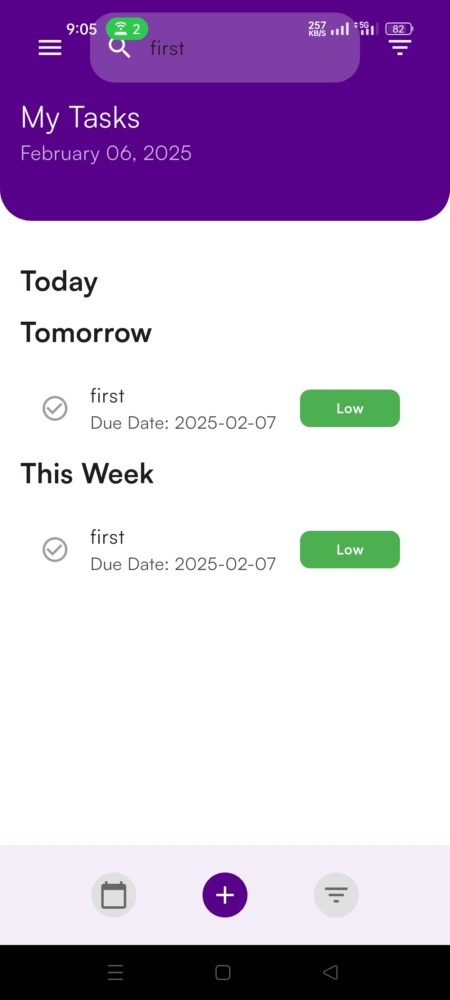

# 🚀 TaskManager

TaskManager is a **powerful yet simple** task management app designed specifically for **gig workers**. It enables users to **seamlessly create, update, delete, and manage tasks** while providing a **smooth user experience**. Built with **Flutter**, it follows **clean architecture principles** and uses **BLoC for state management** to ensure maintainability and scalability.

## ✨ Features

### 🔐 User Authentication
- **Firebase Authentication (email/password)** for secure login and registration.
- Displays **error messages** for invalid credentials, ensuring a smooth experience.

### ✅ Task Management
- Users can **create, edit, delete, and view tasks** effortlessly.
- Each task includes **title, description, due date, and priority** (low, medium, high).
- Mark tasks as **complete/incomplete** with a single tap.

### 🔍 Task Filtering
- **Filter by Priority:** Users can focus on high-priority tasks first.
- **Filter by Status:** Quickly view completed and pending tasks.
- **Sorted by Due Date:** Ensures that upcoming deadlines are always visible.

### 📱 Responsive UI
- **Material Design principles** for an intuitive experience.
- Works seamlessly on both **iOS and Android** with adaptive layouts.

### 🗄️ Local Data Storage
- Tasks are stored using **Firebase Firestore**, ensuring data persistence.
- Even if users switch devices, their tasks remain intact.

### 🔄 State Management with BLoC
- Ensures a **predictable and maintainable** app state.
- **Decouples business logic from UI**, improving testability and scalability.

### 🏗️ Clean Architecture
- **Modular structure** with clear separation of concerns.
- **Easier to scale** and maintain in the long run.

## 📸 Screenshots

<div style="display: flex; flex-wrap: wrap; gap: 100px; justify-content: space-between;">
  
  
  
  
  
  
</div>

## 🏛️ Architecture

TaskManager follows the **Clean Architecture** pattern, dividing the codebase into three layers:

### 1️⃣ Presentation Layer (UI & State Management)
- **Widgets**: Responsible for displaying the UI.
- **BLoC (Business Logic Component)**: Manages the state of the app.

### 2️⃣ Domain Layer (Business Logic)
- **Entities**: Define the core data structures.
- **Use Cases**: Encapsulate business logic (e.g., adding a task, filtering tasks).
- **Repositories (Interfaces)**: Define how data is accessed.

### 3️⃣ Data Layer (Storage & Retrieval)
- **Data Sources**: Handles fetching and storing tasks in **Firebase Firestore**.
- **Repositories (Implementations)**: Provide data to the domain layer.
- **Models**: Define the structure of task data in storage.

---

## 🔄 State Management with BLoC

The app implements **BLoC (Business Logic Component)** to manage state efficiently.

### 🎭 BLoC Components:

- **Events**: Trigger state changes (e.g., `AddTaskEvent`, `DeleteTaskEvent`).
- **States**: Represent different UI states (e.g., `TaskLoading`, `TaskLoaded`).
- **BLoC Class**: Handles events and updates the state accordingly.

This ensures:
- **Clear separation** between UI and logic.
- **Predictable state transitions**.
- **Improved testability** and maintainability.

---

## 🔎 Task Filtering Explained

TaskManager provides advanced filtering options to help users **focus on important tasks**.

### 📌 Filtering by Priority
- View only **high, medium, or low-priority tasks**.
- Ensures users can tackle **urgent** tasks first.

### ✅ Filtering by Status
- **Completed tasks** stay visible for reference.
- **Pending tasks** help users track what’s left.
- Provides a **quick overview** of productivity.

## 📦 Dependencies

TaskManager relies on the following **Flutter dependencies**:

| Dependency         | Purpose                                          |
|--------------------|--------------------------------------------------|
| **flutter_bloc**  | State management using BLoC pattern             |
| **firebase_auth** | User authentication with Firebase               |
| **cloud_firestore** | Task storage in Firebase Firestore           |
| **equatable**     | Simplifies state and event comparisons          |
| **provider**      | Dependency injection and state management       |
| **flutter_test**  | Testing framework for Flutter                   |

---

## 🚀 Getting Started

### 1️⃣ Clone the Repository
```sh
 git clone https://github.com/your-repo/taskmanager.git
 cd taskmanager
```

### 2️⃣ Install Dependencies
```sh
 flutter pub get
```

### 3️⃣ Run the App
```sh
 flutter run
```